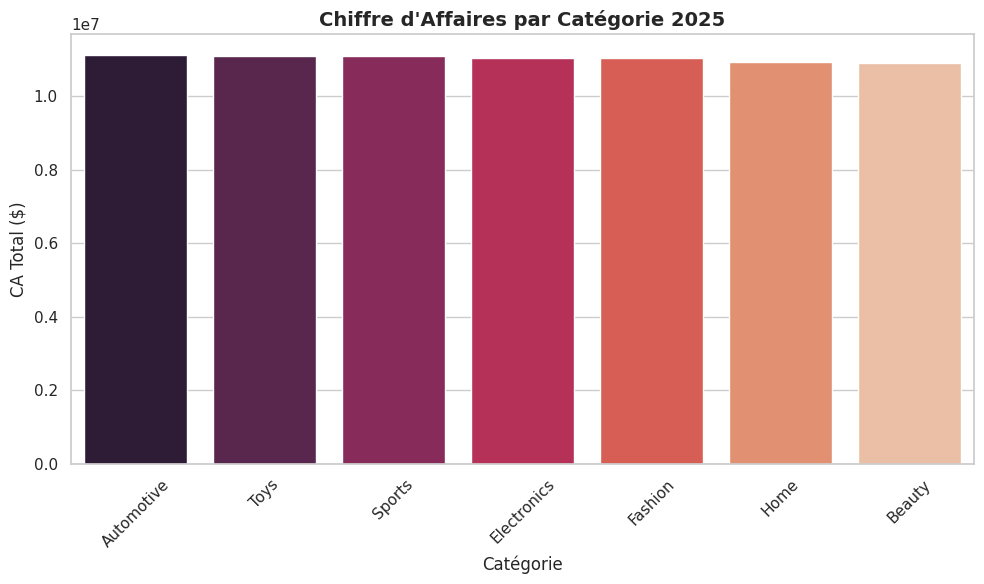

# Analyse E-Commerce 2025 - Portfolio Data Analyst



## Objectif du Projet

Analyse complète des performances de ventes e-commerce avec détection automatique d'erreurs de données et calcul de KPIs métier.

## Dataset Utilisé

- Source : [Synthetic E-Commerce Sales Dataset 2025](https://www.kaggle.com/datasets/emirhanakku/synthetic-e-commerce-sales-dataset-2025)
- Volume : 1000+ transactions sur 7 catégories de produits

## Compétences Démontrées

- Data Cleaning : Normalisation automatique des colonnes
- Analyse Exploratoire : Agrégation par catégorie et calcul du panier moyen
- Visualisation : Graphiques professionnels avec Seaborn/Matplotlib
- Business Intelligence : Identification des catégories les plus rentables

## Résultats Clés

| Catégorie  | CA Total | Panier Moyen |
|------------|----------|--------------|
| Automotive | 11,13M$  | 251,65$      |
| Toys       | 11,11M$  | 252,02$      |
| Sports     | 11,11M$  | 251,74$      |

**Insight** : Les catégories présentent un panier moyen homogène (~252$). Toys offre le meilleur potentiel d'optimisation marketing.

## Technologies

Python · Pandas · Matplotlib · Seaborn · Jupyter Notebook

## Installation
```
Analyse-Ecommerce-2025/
├── Analyse_Performance_E_commerce.ipynb
├── ca_categpries.png
├── synthetic_ecommerce_sales_2025.csv
└── README.md
```
## 🚀 Installation et Utilisation

**Prérequis**

pip install pandas matplotlib seaborn jupyter

**Lancement**
git clone https://github.com/YOUSSEF-BT/Analyse-Ecommerce-2025.git
cd Analyse-Ecommerce-2025
jupyter notebook Analyse_Performance_E_commerce.ipynb


Exécutez toutes les cellules dans l'ordre pour reproduire l'analyse complète.

## 📊 Méthodologie

1. **Préparation** : Chargement et nettoyage automatique des données
2. **Analyse** : Statistiques descriptives et agrégations par catégorie
3. **Visualisation** : Graphiques professionnels pour communication
4. **Insights** : Recommandations stratégiques basées sur les données

## 🎓 Contexte

Projet réalisé dans le cadre de mon développement en **Data Analysis** et **Business Intelligence**. Démontre ma capacité à produire des analyses exploratoires robustes et à communiquer des insights métier.

## 📧 Contact

**Youssef Bouzit**  
🎓 Étudiant Cycle Ingénieur Data Science - SUP MTI Rabat  
📍 Rabat, Maroc

[](https://github.com/YOUSSEF-BT)
[](https://www.linkedin.com/in/youssef-bouzit-74863239b/)
[](https://www.kaggle.com/yussefbt)
---

⭐ **N'hésitez pas à laisser une étoile si ce projet vous a été utile !**

*Dernière mise à jour : Décembre 2025*
